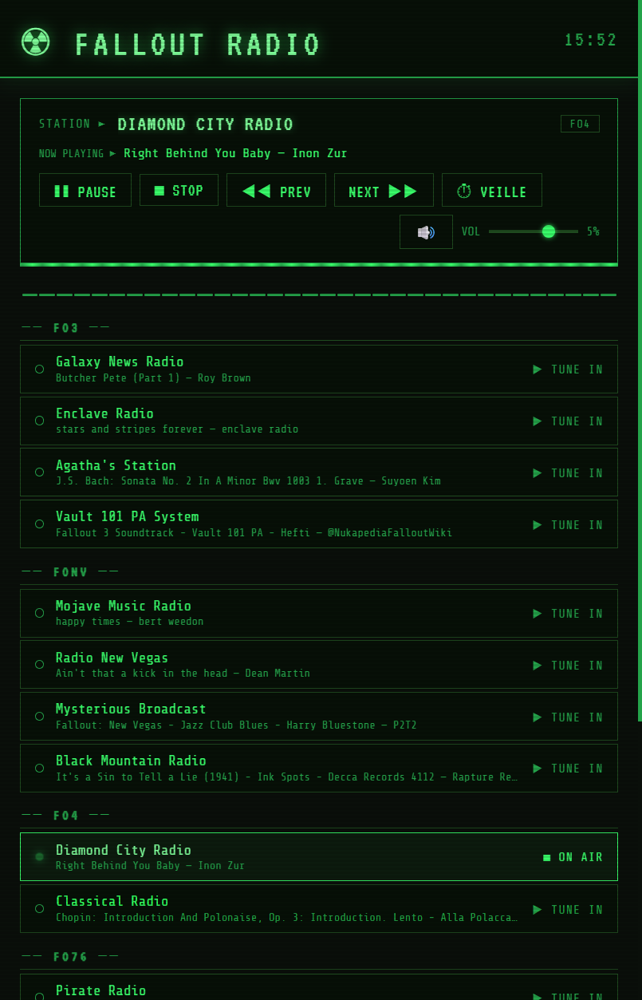

# Fallout Radio

A Pip-Boy-styled internet radio player for the browser. Ships the eleven Fallout in-game
stations out of the box, plays any web radio you point it at, and searches a directory of
~50,000 more.

No build step, no package manager, no framework. Serve the folder and it runs.

**▶ [sonical0.github.io/Radio](https://sonical0.github.io/Radio/)**



> The interface is in French.

## Features

- **The eleven Fallout stations** — Fallout 3, New Vegas, 4 and 76 — with live "now playing"
  metadata for each.
- **Any stream you like.** MP3, AAC, Ogg Vorbis, Opus and FLAC play as-is. M3U and PLS
  playlists are resolved to a direct URL. HLS (`.m3u8`) works too, which is what most large
  broadcasters serve.
- **Metadata without configuration.** Paste an AzuraCast stream URL and the track title
  appears on its own — the API endpoint is derived from the URL. Icecast servers can be
  pointed at by hand.
- **A directory built in.** Search [Radio-Browser](https://www.radio-browser.info/) by name
  or genre and add a station in one click.
- **Your own groupings.** A group is a free label — a game, a genre, a country — not a fixed
  list.
- **Per-station gain**, so a loud stream stops blowing your ears off when you switch to it.
- **Sleep timer** with a slow fade-out, **media keys** and lock-screen controls via the Media
  Session API, **keyboard shortcuts**, and automatic reconnection when a stream drops.
- **Import / export** your custom stations as JSON.
- **Offline-identical rendering.** Fonts, favicon and the HLS library are all served from the
  folder — nothing is fetched from a CDN at load time.

## Quick start

```bash
python3 -m http.server 8080
# → http://localhost:8080
```

Any static file server will do. Opening `index.html` straight from the filesystem will *not*
work: `stations.json` is fetched at load, and `file://` blocks that.

### Docker

```bash
docker compose up -d --build
# → http://localhost:8080
```

nginx-unprivileged, running as a non-root user, with gzip and security headers.
See [DOCKER.md](./DOCKER.md).

## Adding stations

**From the interface** — paste a stream URL into the add form, or search the directory.
Custom stations live in `localStorage`, so they survive reloads and never leave your browser.

**Built in** — add an entry to `stations.json`:

```json
{ "group": "FO4", "name": "My Station", "url": "https://example.org/listen/mine/radio.mp3" }
```

Metadata is usually automatic. To override it, or to reach an Icecast server:

```json
{ "meta": { "type": "icecast", "url": "https://example.org/status-json.xsl" } }
```

Optional fields: `gain` (0–1, attenuates a stream that is louder than the rest) and `hls`
(only needed when an HLS stream's URL does not end in `.m3u8`).

## Keyboard shortcuts

| Key | Action |
| --- | --- |
| <kbd>Space</kbd> | Play / pause |
| <kbd>←</kbd> <kbd>→</kbd> | Previous / next station |
| <kbd>↑</kbd> <kbd>↓</kbd> | Volume |
| <kbd>M</kbd> | Mute |
| <kbd>S</kbd> | Stop |

## How it works

Everything lives in `index.html` — styles, markup and logic, ~108 KB of it, no dependencies
beyond the vendored HLS library. A few decisions worth knowing about:

**No Web Audio API.** It would be the obvious way to boost a quiet stream past `volume = 1`,
and it silently breaks every station: `createMediaElementSource()` reroutes the element into
a graph that receives nothing but silence for these CORS-less cross-origin streams. Loud
stations are turned *down* instead, per-station.

**hls.js is pinned and served locally**, not pulled from a CDN, so the page renders and plays
the same offline and on an isolated network. It takes precedence over the browser's native
HLS support even where `canPlayType()` claims it — some engines answer `"maybe"` with only
partial support, and hls.js surfaces errors the reconnection logic can act on. Native
playback remains the iOS path, where MSE does not exist.

**Metadata is limited by CORS, not by ambition.** AzuraCast and Icecast are the only two
families that reliably send the header from a browser. Shoutcast v2 sends none at all, and
most Icecast operators switch their status endpoint off — which is why AzuraCast, derived
straight from the stream URL, carries most of the weight.

**The station list is a real list.** Each row is a `<li>` containing a `<button>`, not a
`<li role="button">` — the latter flattens its subtree and hides the nested gain slider and
delete control from screen readers.

Further notes for contributors are in [CLAUDE.md](./CLAUDE.md); the full history is in
[CHANGELOG.md](./CHANGELOG.md).

## Browser support

Chrome, Edge, Firefox and Safari, desktop and mobile. HLS goes through hls.js everywhere
except iOS, which plays it natively.

## Credits

- Stream and metadata API: [fallout.radio](https://fallout.radio/)
- Station directory: [Radio-Browser](https://www.radio-browser.info/)
- [hls.js](https://github.com/video-dev/hls.js) — Apache-2.0, vendored under `vendor/`
- Fonts: [VT323](https://fonts.google.com/specimen/VT323) and
  [Share Tech Mono](https://fonts.google.com/specimen/Share+Tech+Mono), SIL Open Font License

Fallout is a trademark of Bethesda Softworks. This is an unaffiliated fan project.
